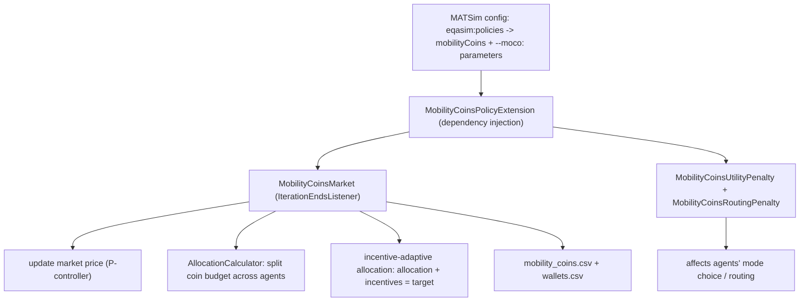

# MobilityCoin code – a guided tour

This document explains how the MobilityCoin (tradable-credit) scheme is implemented so you can
quickly find your way around the code. All paths are relative to
`core/src/main/java/org/eqasim/core/simulation/policies/impl/mobility_coins/`.

## 1. The big picture

MATSim runs many iterations. In each iteration agents (re)plan their day, the traffic is
simulated, and then listeners react. MobilityCoin plugs in as one such listener.



## 2. The per-trip coin balance: `MobilityCoinsCalculator`

`calculateCoinDelta(distances)` converts the modal distances of a trip into a coin change:

```
coins  -=  cost_coins_per_gco2 * emissions_gco2_per_km_car     * car_km
coins  -=  cost_coins_per_gco2 * emissions_gco2_per_km_car     * carPassenger_km
coins  -=  cost_coins_per_gco2 * emissions_gco2_per_km_transit * transit_km
coins  +=  incentive_coins_per_km_bicycle * bicycle_km
coins  +=  incentive_coins_per_km_walking * walk_km
```

So a coin is essentially a unit of CO2 budget. Negative = the trip costs coins (emitting),
positive = the trip earns coins (active modes). The `(distances, person)` overload returns 0 for
agents that are *exempt* (used by the `AGE_EXEMPT` allocation scheme).

## 3. Turning coins into behaviour: the penalties

Agents never see "coins" directly; they react to the **monetary value** of those coins at the
current market price.

- `MobilityCoinsUtilityPenalty` (mode choice): `value_EUR = deltaCoins * marketPrice`, then
  weighted by behavioural parameters `beta_loss_u_per_coin` (for losses, e.g. car) or
  `beta_gain_u_per_coin` (for gains, e.g. cycling). The penalty returned is the negative of this
  utility.
- `MobilityCoinsRoutingPenalty` (routing): the same idea per network link, converted into a time
  penalty so the router avoids coin-expensive links.

When the market price rises, emitting becomes more "expensive" in utility terms and agents shift
modes – this is the lever the scheme pulls.

## 4. The market: `MobilityCoinsMarket`

This is the most important class. Once per iteration (`notifyIterationEnds`) it:

1. **Reconstructs balances** from each agent's selected plan (initial coins + sum of trip deltas).
2. Aggregates **shortage** (agents in debt) and **excess** (agents with leftover coins). The
   market imbalance is `error = shortage - excess`.
3. **Updates the price** (`updateMarketPrice` -> `calculatePIDOutput`): a proportional (P)
   controller. The error is normalized by the target coin budget, multiplied by a gain `Kp`
   (three tiers depending on `cost_coins_per_gco2`), damped near equilibrium, and clipped to a
   maximum step. Price can never go negative.
4. **Re-allocates** next iteration's coin budget (`updateDynamicAllocation`, see §6).
5. **Writes** `mobility_coins.csv` (one row per iteration) and `wallets.csv` (per agent).

Why a pure P-controller (no I or D term)? Because only ~5% of agents replan per iteration, the
system reacts with a long lag; an integral term would "wind up" and overshoot. See the comments
at the top of the class.

## 5. Heterogeneous allocation: the `allocation/` package

The **total** coin budget for an iteration is fixed (derived from the emission target). *How* it
is split between agents is decided by an `AllocationCalculator`:

| Scheme | Class | Idea |
|--------|-------|------|
| `UNIFORM` | `UniformAllocationCalculator` | Everyone gets the same number of coins |
| `INCOME` | `IncomeBasedAllocationCalculator` | Coins ∝ (1/income)^factor → low income gets more |
| `ACCESSIBILITY` | `AccessibilityBasedAllocationCalculator` | Poorly connected agents get more |
| `AGE_EXEMPT` | `AgeExemptAllocationCalculator` | Only ages `[minAge, maxAge]` participate |
| `GRANDFATHERING` | `GrandfatheringAllocationCalculator` | High baseline emitters get more |

Pick one with `--moco:allocationScheme <NAME>`. `MobilityCoinsMarket.createAllocationCalculator()`
maps the enum to the implementation. Supporting classes: `BaselineCoinsCalculator` (computes the
total budget from a baseline run's emissions) and `AccessibilityPrecomputer` (optional, computes
logsum accessibility offline).

## 6. Incentive-adaptive allocation

Coins earned from walking/cycling are *new supply*. If we ignored them, the total coins in the
market would exceed the emission target. So each iteration:

```
effectiveAllocation = targetEmissionCoins - incentiveCoinsEarnedThisIteration
```

`updateDynamicAllocation` recomputes per-agent allocations for this reduced total using the chosen
allocation scheme and writes the new balances into the agents' `wallet` attribute. This keeps the
identity `allocation + incentives = targetEmissionCoins`, i.e. the emission cap stays intact
regardless of how many incentive coins are earned.

## 7. Optional: elastic demand

`strategies/RemoveExpensiveTripsStrategy` can drop discretionary trips (leisure/shopping) for
agents who are deep in coin debt. It is **off by default** (`--moco:tripDroppingEnabled true` to
enable) and is modulated by the market error to avoid harming convergence.

## 8. Wiring it together: `MobilityCoinsPolicyExtension`

This Guice module (`installEqasimExtension`) registers the market as a controler listener, installs
the strategy module, and provides singletons (`@Provides`) for the parameters, calculator, market,
penalties, and CSV writers. `MobilityCoinsPolicyFactory` builds the actual `Policy` object that the
generic eqasim policy framework asks for when a config contains a `mobilityCoins` parameter set.

## 9. Where to start reading

1. `MobilityCoinsParameters` – understand the knobs.
2. `MobilityCoinsCalculator` – understand what a coin is.
3. `MobilityCoinsMarket` – the loop, price control, and allocation.
4. One `allocation/*` calculator of your choice.
